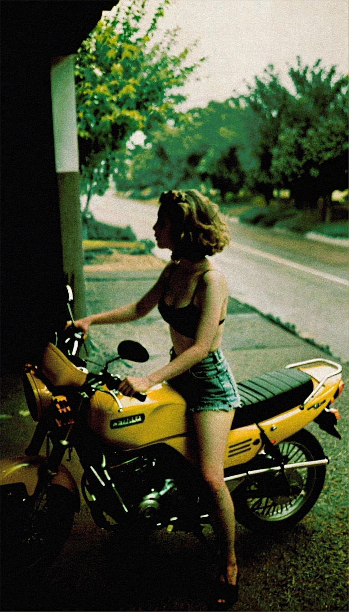
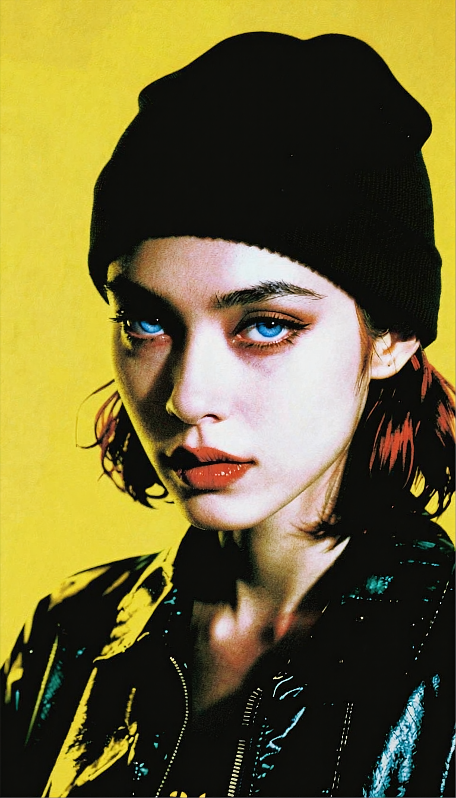

**9:16** | 768x1344 | [prompt.json](./prompt.json) | [workflow.json](./workflow.json)

> A candid photograph taken in a dimly lit indoor setting during late evening with a strong 1980s aesthetic and nostalgic feel. 30mm Amateur photo with film grain.
> 
> This photograph captures a shirtless, slender young woman with short, curly brown hair standing next to a yellow Suzuki motorcycle parked on a gravel road. she wears only green denim shorts and bra. The motorcycle has a black seat and metal frame. The background features lush green trees and a power line running parallel to the road, which is wet, suggesting recent rain. The image has a nostalgic, 1980s feel with muted colors and a slightly grainy texture.,,

## Examples

> aosiai123_illu, ,rakugakingu, Harley Quinn,
> ,masterpiece, best quality, ultra-detailed, highres, 8k, 
> cinematic position, 1girl, solo, close up, portrait, looking at viewer, intense gaze, black beanie, black jacket, yellow accent,  large blue eyes, solid yellow background, (high contrast:1.4), dramatic lighting, sharp shadows, color isolation, vivid colors

