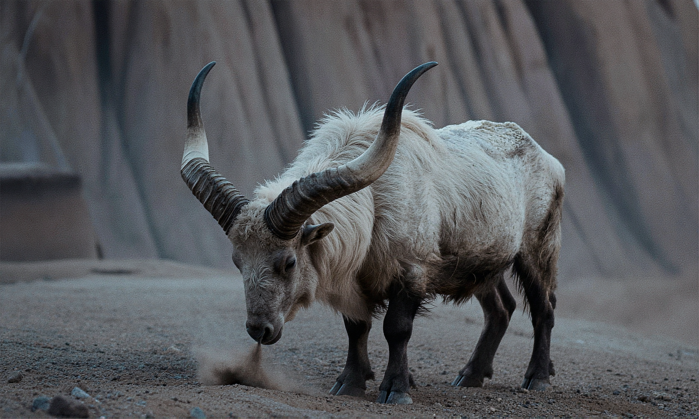

**8:5** | 1664x1000 | [prompt.json](./prompt.json) | [workflow.json](./workflow.json)

> A large, horned creature with thick white and black fur stands in a rocky, arid landscape under dim, cool-toned lighting. Its two long, sharply curved horns extend upward and outward from its skull, tapering to dark, pointed tips; the lower portions of the horns are segmented with ridges. The creature’s head is lowered, its snout close to the ground kicking up a small cloud of dust and loose gravel around its front hooves. Its body is covered in shaggy fur that appears matted and dirty, particularly on its flanks and legs. Behind it, the background consists of blurred rock formations with vertical striations, rendered in muted browns and grays. The foreground shows a rough, uneven surface of sand and small stones. Shadows fall across the creature’s body from an unseen light source above and to the left, creating depth and emphasizing its muscular form. The overall image has a shallow depth of field, keeping the creature sharply focused while blurring the background and foreground elements.

