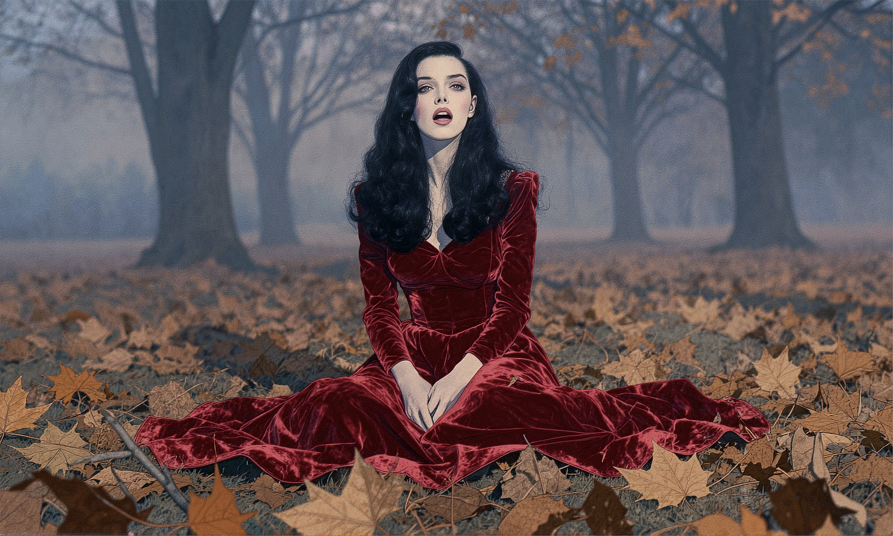
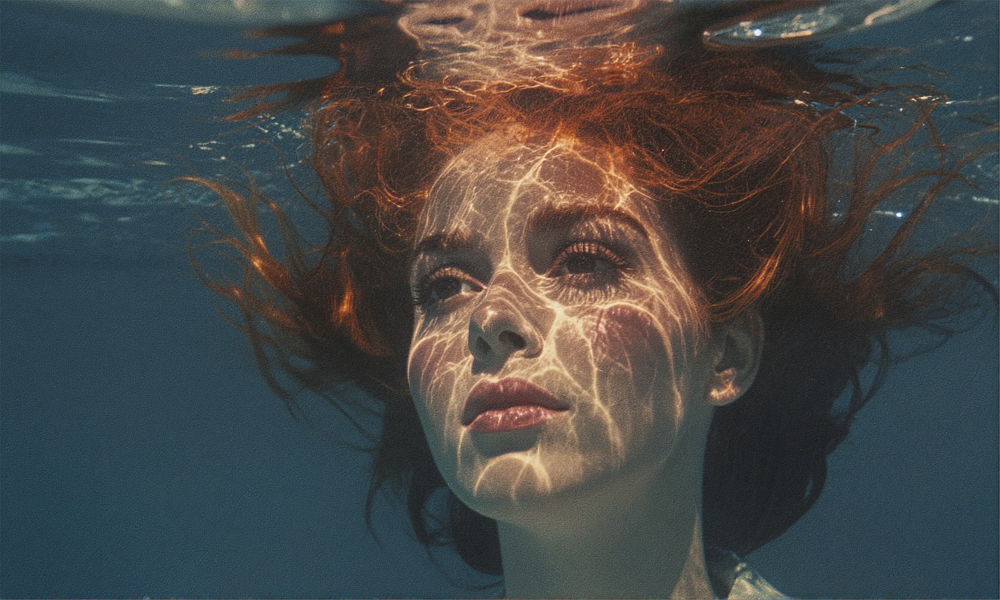

**8:5** | 1664x1000 | [prompt.json](./prompt.json) | [workflow.json](./workflow.json)

> ((watercolor painting, watercolor art)), painterly, in the style of cksc, scene of a woman trying to walk her dog in the snow, 1woman, black hair, ponytail, short green jacket, white trim, white mittens, faded jeans, brown boots, tangled in her dog's leash.
> The woman has become tangled in her dog's leash and has lost her balance. The leash is wrapped around her legs, and she is in the process of falling down into the snow. The border collie is trying to run in the opposite direction of the woman, but is held back by the leash. The woman's eyes are wide with a look of surprise and disbelief on her face. The scene is comedic and vibrant. Light snowfall, outdoor scenery, winter scenery, expression and dog focus

## Examples

> subject: A IGMODEL woman with very pale luminous porcelain skin (screaming and suprised expression on her face ) and subtle Eastern European features with extremely long wavy black hair that cascades down her back and spills outward until it reaches and spreads across the leafy ground around her sits upright on the ground with her legs folded to one side and her spine elongated in a composed posture. Her shoulders are relaxed and her hands rest gently on her lap with long fingers lightly touching the velvet fabric. Her head is slightly tilted downward while her eyes lift toward the camera with a reflective distant expression. Her eyebrows are softly defined and her lips are natural rose with a muted satin finish. She wears a deep crimson velvet dress with a structured bodice and long fitted sleeves while the skirt pools heavily around her hips in thick light absorbing folds that emphasize the richness of the fabric. foreground: The immediate foreground is layered with dry fallen autumn leaves in shades of rust brown amber and muted gold that form a textured uneven carpet across the ground. Some leaves are curled and brittle with visible veins and torn edges while a few are slightly damp and darker in tone. A thin branch lies diagonally near the bottom edge of the frame partially blurred by shallow depth of field creating dimensional separation. background: Behind her stand bare autumn trees with slender gray trunks and fine branches stretching upward without foliage. A soft morning mist hangs low between the trees diffusing the distance and creating atmospheric depth. The forest floor continues into the distance with scattered leaves fading into cooler blue shadows as the light weakens further back. The far background gradually softens into haze with faint silhouettes of additional trees barely visible. scene: This is an outdoor fashion portrait captured on an iPhone in vertical orientation with a simulated portrait focal length. The camera is positioned at eye level with symmetrical centered framing to create a balanced composition. Soft diffused morning light filters through the mist from camera left casting cool blue shadows that contrast against the deep red velvet. The subject remains sharp while the distant trees fade gently out of focus. The image has subtle iPhone sharpening slight natural noise in the shadows and realistic exposure falloff. There is no heavy filter and no cinematic grading and the mood feels moody seasonal refined and grounded in fine art realism.

> Arlequin art style: A cinematic portrait of a person submerged underwater, their face half-illuminated by warm orange light filtering through rippling water surfaces above, casting glowing, crackling patterns across skin and features; cool blue tones dominate the lower half of the frame, contrasting sharply with fiery reflections on the forehead and nose; hair flows upward like liquid silk amidst distorted light beams; shallow depth of field emphasizes ethereal textures and surreal ambiance reminiscent of dreamlike aquatic photography — high contrast, grainy film aesthetic, moody atmosphere evoking mystery and introspection. <lora:Beyond_The_Mist_E10:0.5> <lora:another_earth_E15:0.5> <lora:Arlequin_E16:0.5>

