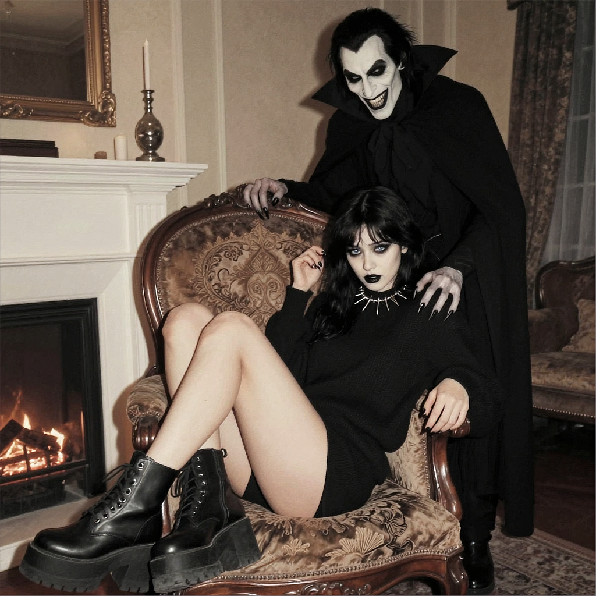
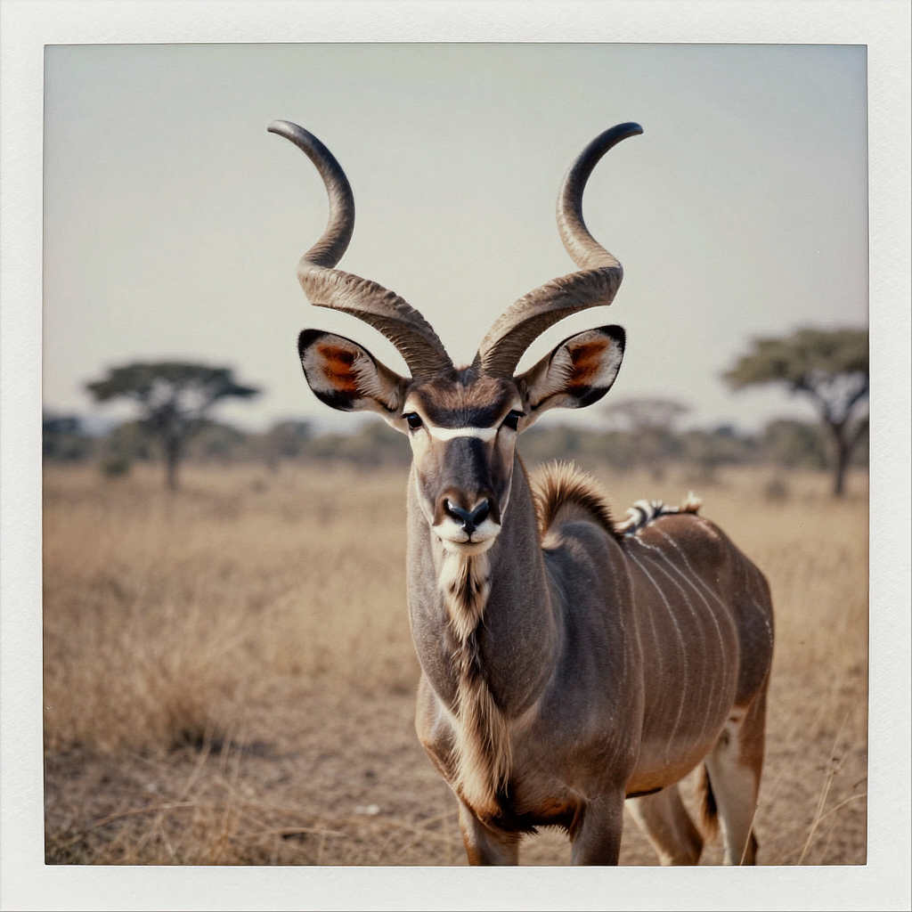
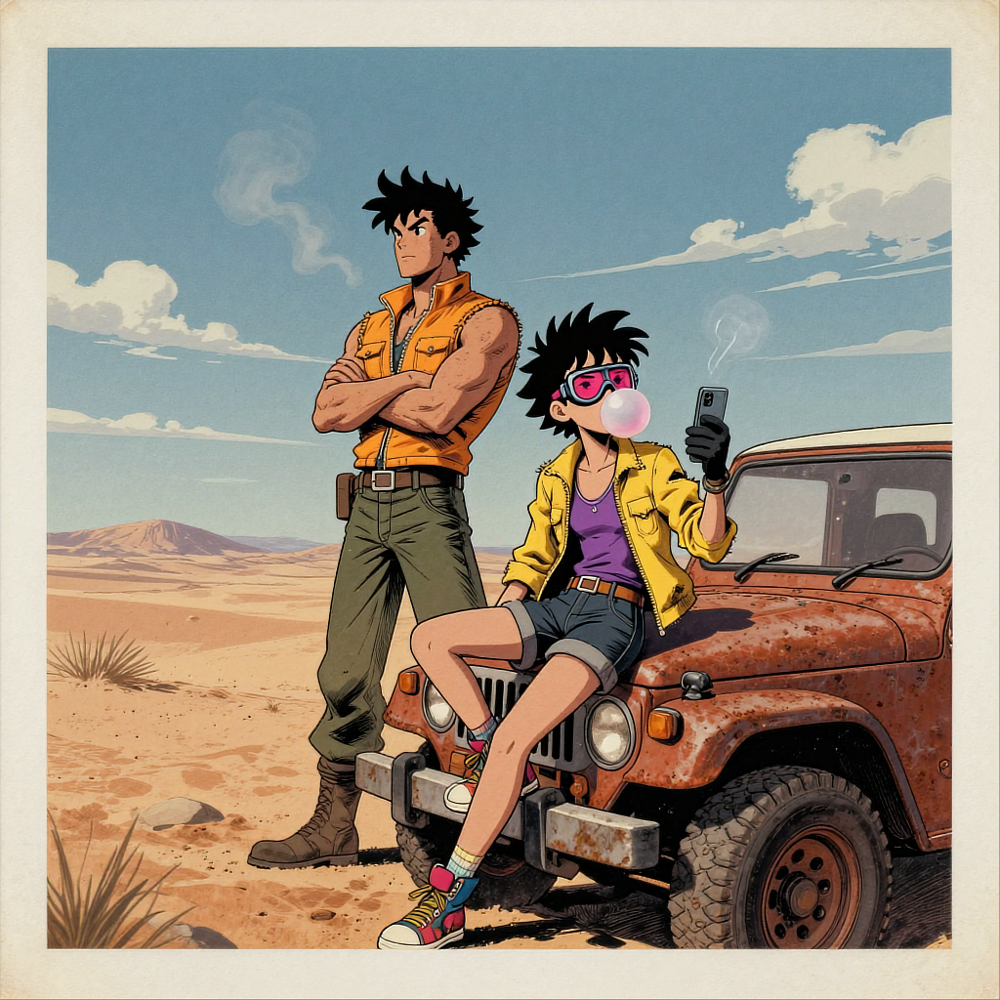
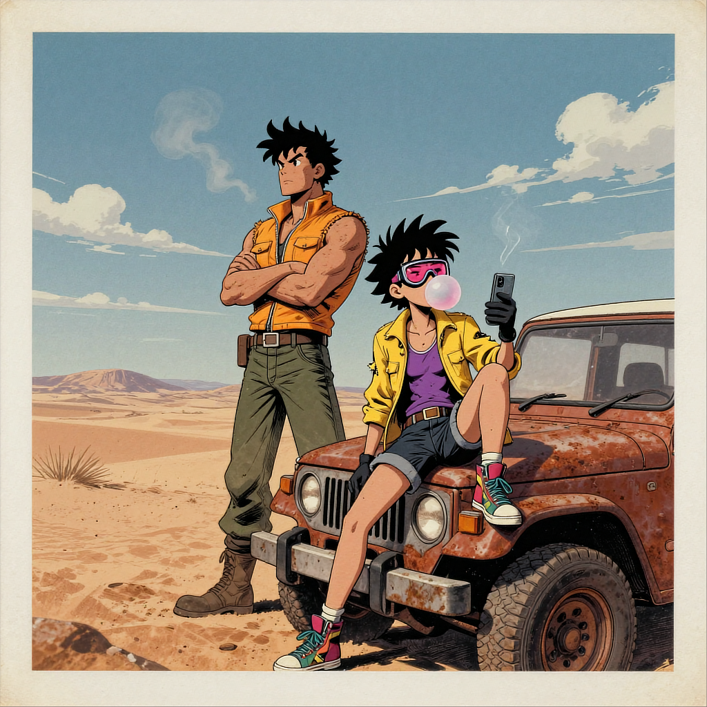

**1:1** | 1024x1024 | [prompt.json](./prompt.json) | [workflow.json](./workflow.json)

> Neo-noir digital illustration, with a high-contrast chiaroscuro lighting style.
> A goth girl with thick thighs is sitting in a large embroidered gothic chair indoors, in a dimly lit room overlooking a fireplace. She is wearing platform boots, black sweater, spiky collar, has painted black nails. She has medium length black hair, black lipstick and makeup, her eyes are blue. She looks down with a terrified expression, her hands are nervously clutching the chair. Behind her, there's a faceless shadowy silhouette of a tall vampire man with long hair, cloak, an evil grin on his face, he places one hand with long pale clawed fingers onto her shoulder. 

## Examples

> A real photograph of an Greater Kudu antelope. The antelope is directly seen from front and is looking at the viewer.

> Inkquaria art style: A vibrant comic-detailed illustration depicts two stylized characters in a sun-baked desert landscape under a clear blue sky dotted with wispy clouds. In the foreground, a character with spiky black hair and pink-tinted goggles sits casually on the hood of a rust-colored off-road vehicle, legs crossed, blowing a bubble gum bubble while holding a small rectangular device—perhaps a phone or tablet—with both gloved hands; their outfit includes a torn yellow jacket over a purple tank top, dark shorts, and colorful sneakers. Behind them stands another muscular figure with wild spiked hair, wearing a sleeveless orange-yellow vest, green pants, and boots, arms crossed as if observing or waiting; faint smoke curls from behind them like steam rising into air. The scene is rendered with bold linework, saturated colors, dynamic shadows, and gritty textures typical of action-comic illustrations — signature artist’s mark visible subtly at bottom right corner. lora:Inkquaria_E10:0.75

> Inkquaria art style: A vibrant comic-detailed illustration depicts two stylized characters in a sun-baked desert landscape under a clear blue sky dotted with wispy clouds. In the foreground, a character with spiky black hair and pink-tinted goggles sits casually on the hood of a rust-colored off-road vehicle, legs crossed, blowing a bubble gum bubble while holding a small rectangular device—perhaps a phone or tablet—wth both gloved hands; their outfit includes a torn yellow jacket over a purple tank top, dark shorts, and colorful sneakers. Behind them stands another muscular figure with wild spiked hair, wearing a sleeveless orange-yellow vest, green pants, and boots, arms crossed as if observing or waiting; faint smoke curls from behind them like steam rising into air. The scene is rendered with bold linework, saturated colors, dynamic shadows, and gritty textures typical of action-comic illustrations — signature artist’s mark visible subtly at bottom right corner. lora:Inkquaria_E10:0.75

