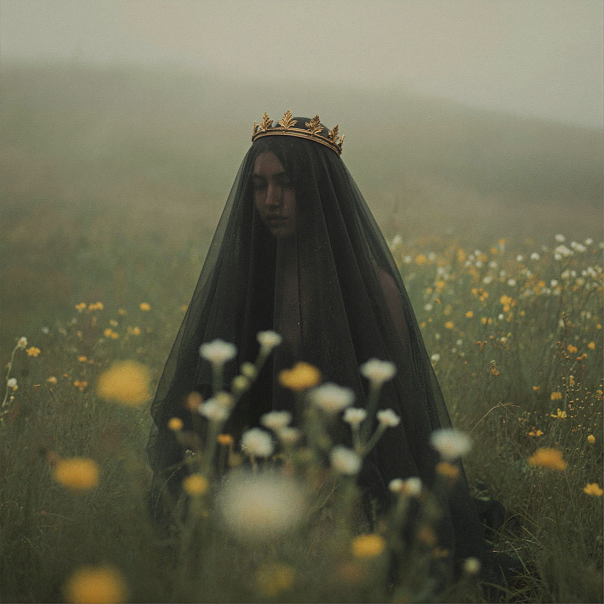
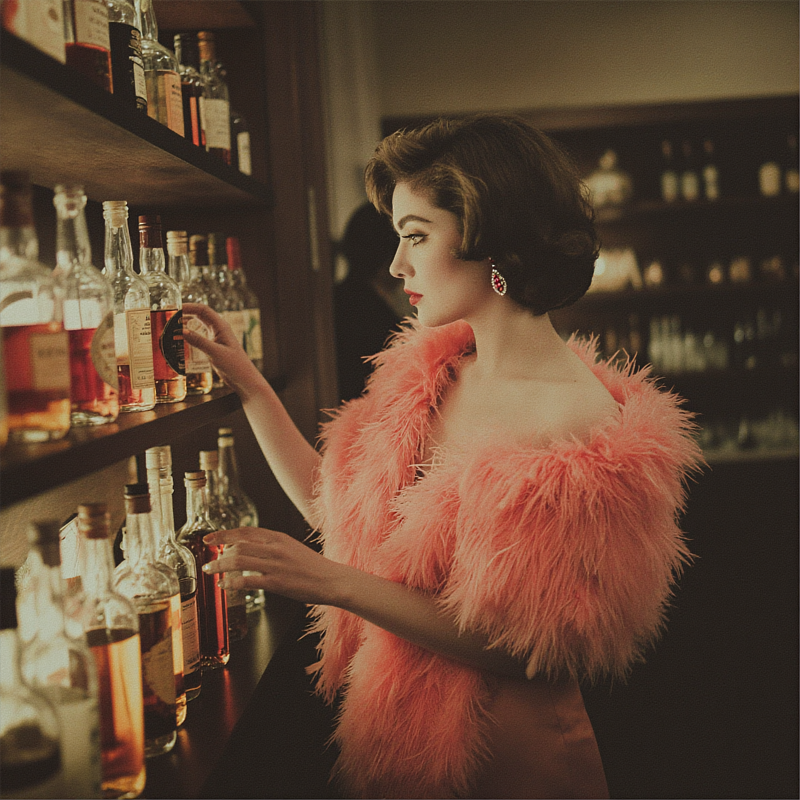

**1:1** | 1328x1328 | [prompt.json](./prompt.json) | [workflow.json](./workflow.json)

> A solitary, enigmatic feminine figure standing motionless in a wild meadow filled with delicate pale-yellow and white wildflowers, captured from behind, her identity completely concealed beneath a long, translucent black veil. The veil drapes softly from a delicate antique golden crown resting on her head, falling down over her face and shoulders, obscuring all facial features and turning the figure into an anonymous symbol rather than an individual. The crown is ornate and finely crafted, medieval in design, made of aged gold with subtle patina, featuring pointed leaf-like motifs and engraved filigree details. It sits gently atop the veil, slightly embedded into the sheer fabric, catching soft ambient light along its edges. The gold is not shiny or polished, but muted, old, and dignified — a relic rather than an ornament. The veil itself is ultra-thin, semi-transparent, layered fabric, textured with fine dust-like particles, pollen, and microscopic imperfections. Light passes through it softly, revealing only a vague dark silhouette of the head beneath, with no readable facial structure. The veil moves almost imperceptibly in the air, suggesting stillness rather than motion. The surrounding meadow is dense with wild plants and flowers, primarily soft yellow and pale white blossoms, with thin green stems and delicate leaves. The flowers partially obscure the lower portion of the figure, creating depth and a sense of immersion. Foreground flowers are heavily out of focus, creating creamy bokeh shapes that frame the subject naturally. Midground flowers are softly detailed, while background vegetation dissolves into atmospheric blur. The environment feels humid, cool, and slightly fog-laden, as if early morning or late evening. Fine mist particles and dust float in the air, visible only where light catches them. The color palette is subdued and poetic: desaturated greens, muted yellows, soft greys, deep charcoal blacks, and antique gold accents. No vibrant or saturated colors. Lighting is natural, diffuse, and cinematic — no harsh shadows. A soft overcast sky provides even illumination, with subtle highlights on the crown edges and gentle light diffusion through the veil fabric. The scene feels timeless, suspended between eras, neither modern nor clearly historical. The composition emphasizes mystery and restraint. The subject is centered but partially obscured by flora, reinforcing the sense of secrecy and distance. There is no direct narrative action — only presence. The figure does not interact with the environment; she exists within it as a silent witness or forgotten monarch. The emotional tone is melancholic, sacred, and contemplative. Themes of loss, memory, anonymity, forgotten royalty, death, mourning, ritual, and nature reclaiming power. The image feels like a visual poem rather than a scene. The photograph feels like high-end fine art photography combined with cinematic realism, bordering on painterly only through depth of field and atmosphere — not through brush strokes or illustration. No visible face, no eyes, no expression — the veil is absolute. The figure’s gender is implied only through posture and symbolism, not anatomy. Full-frame camera simulation, 85mm prime lens equivalent, shallow depth of field, f/1.8–f/2.2, natural optical bokeh, soft focus falloff. Subject in midground focus, foreground flowers heavily blurred, background softly diffused. ISO 400–800 subtle film grain, cinematic noise profile, organic texture, no digital artifacts. Resolution: ultra-high detail, 8K quality, realistic micro-textures in fabric, metal, and flora. Dynamic range preserved, no crushed blacks, no blown highlights. Soft contrast curve, gentle roll-off in highlights. Muted cinematic grading Cool green undertones Soft yellow highlights Antique gold accents Deep charcoal blacks Desaturated, restrained palette No modern color grading trends No teal-orange exaggeration Subtle film emulation feel, almost analog. Centered composition with organic framing Foreground blur used as natural vignette Subject partially hidden by flowers Vertical orientation Strong sense of depth layers No symmetry perfection Fine art photography Dark romanticism Symbolist imagery Cinematic realism Poetic minimalism Museum-grade visual storytelling (No direct artist references)

## Examples

> subject: A cinematic side profile portrait of a woman with short softly curled brown hair stands at a dimly lit bar shelf lined with vintage liquor bottles. She turns her head slightly to the right with a poised contemplative expression and softly defined red lips. She wears dramatic red gemstone earrings and a voluminous coral feather stole draped over her shoulders creating a bold glamorous silhouette. Her posture is elegant and upright with her shoulders angled toward the shelves as if selecting a bottle. foreground: The foreground highlights the rich glass textures of assorted whiskey and spirit bottles arranged in neat rows on dark wooden shelves. Amber and ruby liquid tones catch warm reflections from the bar lighting while labels and metallic caps create layered visual detail. The soft feather texture of her stole contrasts against the hard reflective glass surfaces. background: The background recedes into shadowed shelving filled with additional bottles and bar décor creating depth and an intimate speakeasy atmosphere. The dark wood and low light environment frame her coral silhouette against the moody interior. scene: This is a cinematic editorial portrait captured at eye level with an 85mm lens equivalent and shallow depth of field. Warm tungsten bar lighting casts golden highlights across the bottles and gentle glow along her cheek and jawline while the rest of the environment fades into soft darkness. The composition emphasizes contrast between luxurious textures including feathers glass wood and gemstone accents. The overall mood feels vintage glamorous and atmospheric with refined old Hollywood influence and moody nightlife elegance.

