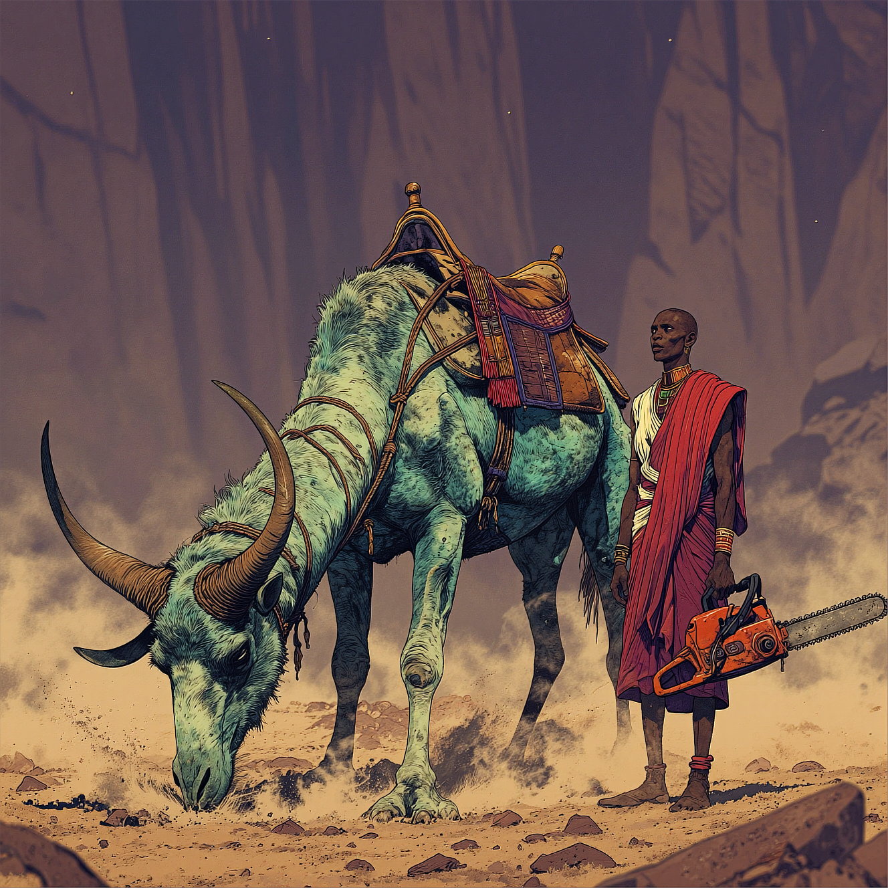

**1:1** | 1328x1328 | [prompt.json](./prompt.json) | [workflow.json](./workflow.json)

> A large, horned creature with thick pale mint green and deep teal-green fur stands in a rocky, arid landscape under dim, warm amber-toned lighting. Its two long, sharply curved horns extend upward and outward from its skull, tapering to olive-brown pointed tips; the lower portions of the horns are segmented with ridges. The creature's head is lowered, its snout close to the ground kicking up a small cloud of warm ochre dust and loose gravel around its front hooves. Its body is covered in shaggy fur that appears matted and dirty, particularly on its flanks and legs. Strapped across the creature's broad back is a traditional camel saddle — a wooden-framed, high-cantled desert saddle with worn leather seating, decorative tassels in deep red and gold hanging from its sides, and thick woven girth straps cinched firmly beneath the creature's belly, slightly buried in the shaggy teal-green fur. Standing tall beside the mythical beast is a Maasai goatherder, his posture proud and unwavering. He wears traditional flowing robes in vivid crimson red draped over one shoulder, crossed with bands of brilliant white cloth wrapped around his lean frame. In his right hand, he grips a heavy chainsaw — its orange and black body worn but functional, the serrated blade extending outward, engine idle — held firmly at his side with casual authority. His stance is calm and commanding, as though he has guided creatures far stranger than this one across the savanna. Beaded jewelry in geometric patterns adorns his neck and wrists, catching glints of the amber light. His gaze is steady, fixed on the horizon, unflinching even as the massive beast stirs the dust at his feet. Behind them, the background consists of blurred rock formations with vertical striations, rendered in muted purples and magentas. The foreground shows a rough, uneven surface of golden-tan sand and small stones. Shadows fall across both the creature's body and the herder's robes from an unseen light source above and to the left, creating depth and emphasizing the muscular form of the beast and the dignified silhouette of the man. The overall image has a shallow depth of field, keeping the creature and the goatherder sharply focused while blurring the background and foreground elements.

> YOUR CONTEXT:
> You are a cinematographer who works in dark movies.
> Your photographs exhibit intense side lighting and gobo-crafted patterns to sculpt deep, sharply defined shadows, along with a muted Ektachrome palette that evokes film noir.
> YOUR PHOTO:
> in the style of cksc, close-up portrait, beautiful 1girl woman, long wavy hair cascading hair around her facem, Subtle mechanical features integrated into her face and neck, blending seamlessly with her natural beauty, chiaroscuro style, with extreme contrast between light and shadow, creating a dramatic, moody effect, background is completely black, neon pink light illuminating select areas of her face, hair, and mechanical elements, adding a futuristic glow, contrast of neon pink and black enhances the surreal atmosphere, blending organic beauty with mechanical details for a striking cybernetic aesthetic. masterpiece,best quality,amazing qualityin the style of cksc,

