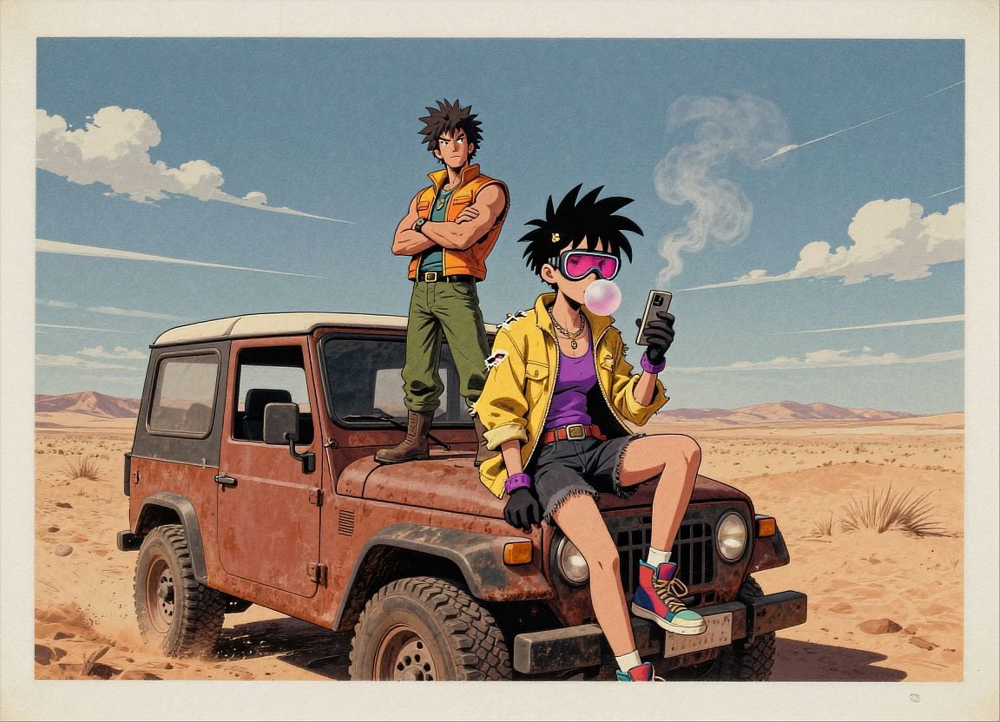

**7:5** | 1152x832 | [prompt.json](./prompt.json) | [workflow.json](./workflow.json)

> Inkquaria art style: A vibrant comic-detailed illustration depicts two stylized characters in a sun-baked desert landscape under a clear blue sky dotted with wispy clouds. In the foreground, a character with spiky black hair and pink-tinted goggles sits casually on the hood of a rust-colored off-road vehicle, legs crossed, blowing a bubble gum bubble while holding a small rectangular device—perhaps a phone or tablet—with both gloved hands; their outfit includes a torn yellow jacket over a purple tank top, dark shorts, and colorful sneakers. Behind them stands another muscular figure with wild spiked hair, wearing a sleeveless orange-yellow vest, green pants, and boots, arms crossed as if observing or waiting; faint smoke curls from behind them like steam rising into air. The scene is rendered with bold linework, saturated colors, dynamic shadows, and gritty textures typical of action-comic illustrations — signature artist’s mark visible subtly at bottom right corner. lora:Inkquaria_E10:0.75

