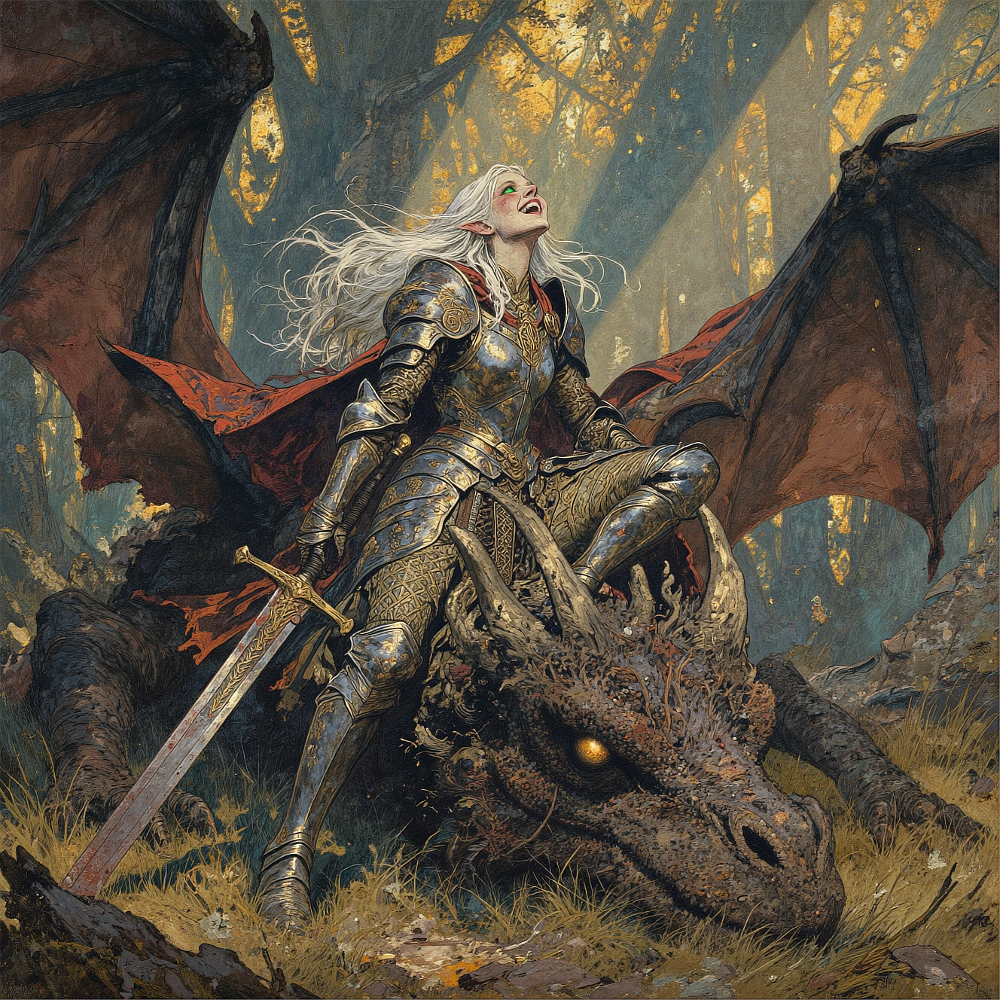
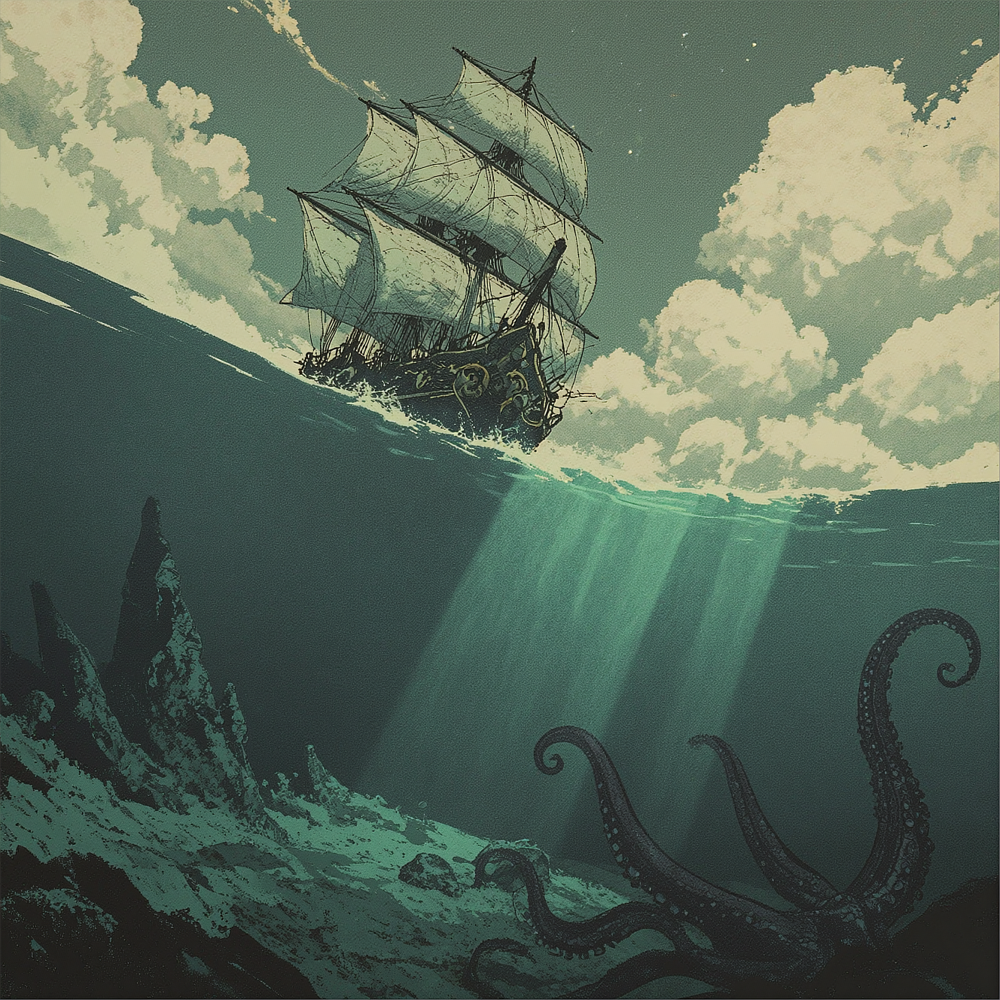
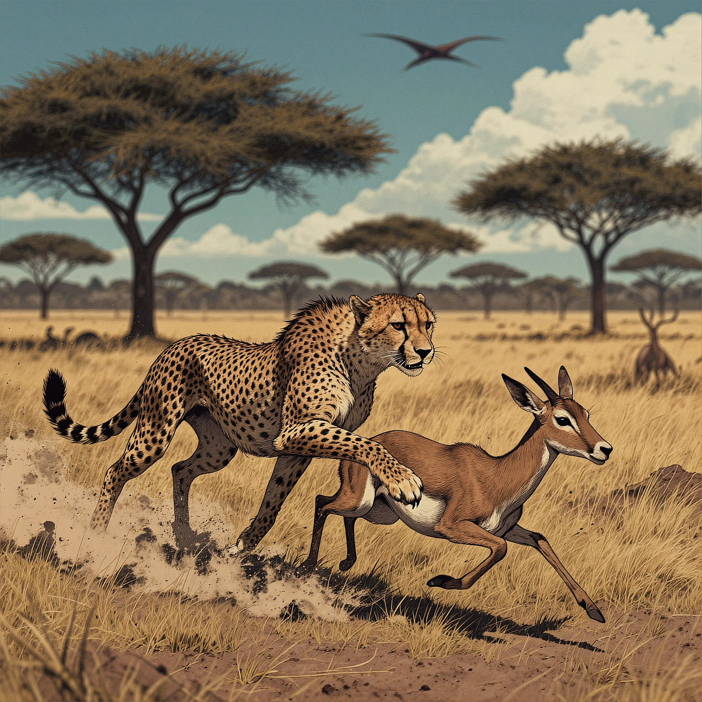
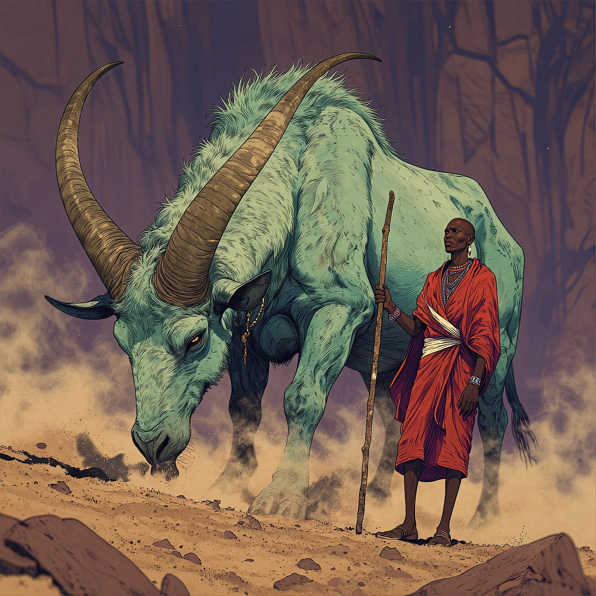

**1:1** | 1328x1328 | [prompt.json](./prompt.json) | [workflow.json](./workflow.json)

> masterpiece, high quality, Oil Painting, A cheerful elven warrior, her long white hair windswept and eyes gleaming with satisfaction, sits triumphantly splayed out on the massive, blood-speckled nose of a colossal dead dragon. She wears gleaming full plate armor etched with elegant sylvan runes and leaf motifs, dented and scuffed from battle yet radiant under the golden afternoon sun. One gauntleted hand clutches a long, rune-inscribed greatsword resting casually across her lap, its blade stained crimson. Her face is a pale translucent white, eyes bright green, and small petite body. Her expression beams with joy and disbelief, laughing openly with her head tilted back—caught in a mix of exhaustion and giddy victory. The dragon’s body sprawls across a shattered forest clearing behind her, its enormous obsidian-black wings crumpled like broken sails, horns splintered, and lifeless golden eye half-lidded beneath her boots. Around them, shafts of warm light pierce the canopy of trees, highlighting the surreal peace after such an intense battle. Bits of her tattered red cloak flutter behind her in a lazy breeze. The mood is triumphant and serene, with a hint of disbelief—an epic moment frozen at the peak of victory. Masterpiece, intricate lines, intriguing atmosphere, sharp magnificent details, delicate features, elaborate details, (2/3 rule composition:0.5), ultra detailed, romantic, oil painting, in the style of Rembrandt. FS, NixPort, novuschroma,

> YOUR CONTEXT:
> You are a cinematographer who works in dark movies.
> Your photographs exhibit intense side lighting and gobo-crafted patterns to sculpt deep, sharply defined shadows, along with a muted Ektachrome palette that evokes film noir.
> YOUR PHOTO:
> in the style of cksc, close-up portrait, beautiful 1girl woman, long wavy hair cascading hair around her facem, Subtle mechanical features integrated into her face and neck, blending seamlessly with her natural beauty, chiaroscuro style, with extreme contrast between light and shadow, creating a dramatic, moody effect, background is completely black, neon pink light illuminating select areas of her face, hair, and mechanical elements, adding a futuristic glow, contrast of neon pink and black enhances the surreal atmosphere, blending organic beauty with mechanical details for a striking cybernetic aesthetic. masterpiece,best quality,amazing qualityin the style of cksc,

## Examples

> pixel artwork with a green monochromatic palette depicting a surreal underwater and above-water scene. The upper half shows a ship with sails and a starry sky while the lower half reveals a treacherous underwater landscape with jagged cliffs ruins and a large coiled tentacle in the foreground. Light from the surface illuminates the underwater scene creating a gradient from dark green at the bottom to lighter green near the surface. The composition uses a split-level perspective emphasizing the divide between the two worlds. Textures include the rough rocky underwater terrain and the smooth cloudy sky. The mood is mysterious and slightly ominous with a dynamic interplay between the calm surface and the chaotic underwater environment. The use of light and shadow enhances the depth and three-dimensionality of the scene.
> 
> YOUR CONTEXT:
> You are a cinematographer who works in dark movies.
> Your photographs exhibit intense side lighting and gobo-crafted patterns to sculpt deep, sharply defined shadows, along with a muted Ektachrome palette that evokes film noir.
> YOUR PHOTO:
> in the style of cksc, close-up portrait, beautiful 1girl woman, long wavy hair cascading hair around her facem, Subtle mechanical features integrated into her face and neck, blending seamlessly with her natural beauty, chiaroscuro style, with extreme contrast between light and shadow, creating a dramatic, moody effect, background is completely black, neon pink light illuminating select areas of her face, hair, and mechanical elements, adding a futuristic glow, contrast of neon pink and black enhances the surreal atmosphere, blending organic beauty with mechanical details for a striking cybernetic aesthetic. masterpiece,best quality,amazing qualityin the style of cksc,

> A dramatic, high-shutter-speed action shot of a cheetah in mid-stride, muscles rippling under its spotted coat as it makes contact with a leaping gazelle. The cheetah is captured in a powerful pounce, claws extended, while the deer-like gazelle contorts in a desperate attempt to escape. Dust kicks up in sharp, frozen particles from the dry savannah floor. The background is a high-speed motion blur of golden grass and distant acacia trees, emphasizing the raw speed and intensity of the hunt. Photorealistic, intense wildlife photography, razor-sharp focus on the predators' eyes.Shot on Canon EOS R3, 400mm f/2.8L IS USM lens, aperture f/2.8, 1/4000s shutter, ISO 800. Extreme action motion blur background with shallow depth of field. There is a blurred out of focus outline of a herd of brontosauuses and pterodactyles flying in the sky in the trees in the background , 
> 
> YOUR CONTEXT:
> You are a cinematographer who works in dark movies.
> Your photographs exhibit intense side lighting and gobo-crafted patterns to sculpt deep, sharply defined shadows, along with a muted Ektachrome palette that evokes film noir.
> YOUR PHOTO:
> in the style of cksc, close-up portrait, beautiful 1girl woman, long wavy hair cascading hair around her facem, Subtle mechanical features integrated into her face and neck, blending seamlessly with her natural beauty, chiaroscuro style, with extreme contrast between light and shadow, creating a dramatic, moody effect, background is completely black, neon pink light illuminating select areas of her face, hair, and mechanical elements, adding a futuristic glow, contrast of neon pink and black enhances the surreal atmosphere, blending organic beauty with mechanical details for a striking cybernetic aesthetic. masterpiece,best quality,amazing qualityin the style of cksc,

> A large, horned creature with thick pale mint green and deep teal-green fur stands in a rocky, arid landscape under dim, warm amber-toned lighting. Its two long, sharply curved horns extend upward and outward from its skull, tapering to olive-brown pointed tips; the lower portions of the horns are segmented with ridges. The creature's head is lowered, its snout close to the ground kicking up a small cloud of warm ochre dust and loose gravel around its front hooves. Its body is covered in shaggy fur that appears matted and dirty, particularly on its flanks and legs. Standing tall beside the mythical beast is a Maasai goatherder, his posture proud and unwavering. He wears traditional flowing robes in vivid crimson red draped over one shoulder, crossed with bands of brilliant white cloth wrapped around his lean frame. In his right hand, he grips a long wooden staff—smooth, sun-bleached, and worn from years of use—planted firmly in the earth beside him. His stance is calm and authoritative, as though he has guided creatures far stranger than this one across the savanna. Beaded jewelry in geometric patterns adorns his neck and wrists, catching glints of the amber light. His gaze is steady, fixed on the horizon, unflinching even as the massive beast stirs the dust at his feet. Behind them, the background consists of blurred rock formations with vertical striations, rendered in muted purples and magentas. The foreground shows a rough, uneven surface of golden-tan sand and small stones. Shadows fall across both the creature's body and the herder's robes from an unseen light source above and to the left, creating depth and emphasizing the muscular form of the beast and the dignified silhouette of the man. The overall image has a shallow depth of field, keeping the creature and the goatherder sharply focused while blurring the background and foreground elements.
> 
> YOUR CONTEXT:
> You are a cinematographer who works in dark movies.
> Your photographs exhibit intense side lighting and gobo-crafted patterns to sculpt deep, sharply defined shadows, along with a muted Ektachrome palette that evokes film noir.
> YOUR PHOTO:
> in the style of cksc, close-up portrait, beautiful 1girl woman, long wavy hair cascading hair around her facem, Subtle mechanical features integrated into her face and neck, blending seamlessly with her natural beauty, chiaroscuro style, with extreme contrast between light and shadow, creating a dramatic, moody effect, background is completely black, neon pink light illuminating select areas of her face, hair, and mechanical elements, adding a futuristic glow, contrast of neon pink and black enhances the surreal atmosphere, blending organic beauty with mechanical details for a striking cybernetic aesthetic. masterpiece,best quality,amazing qualityin the style of cksc,

